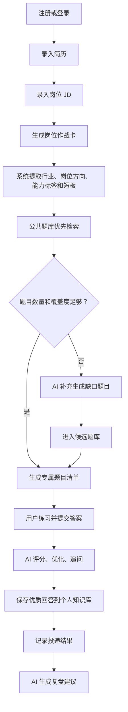
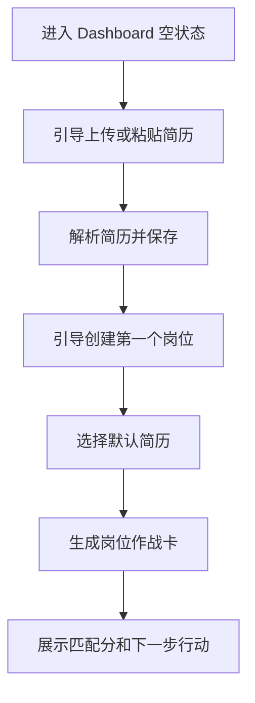
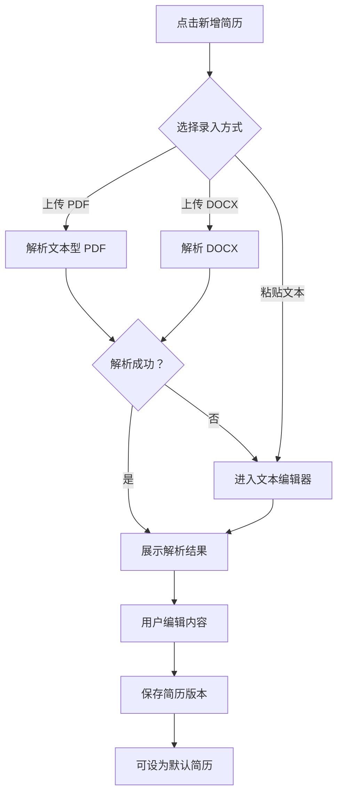
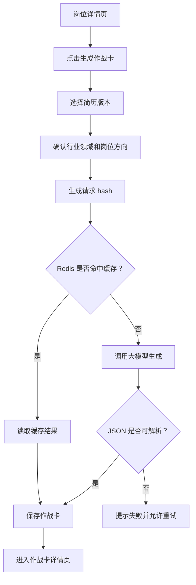
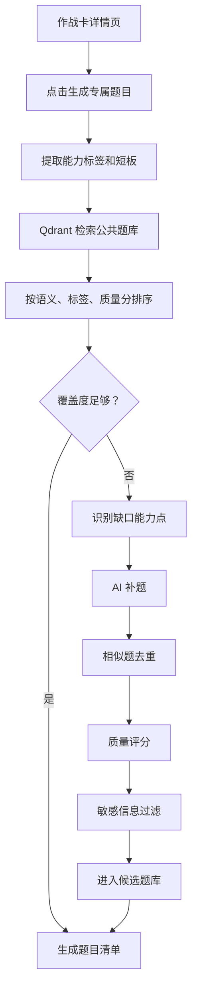
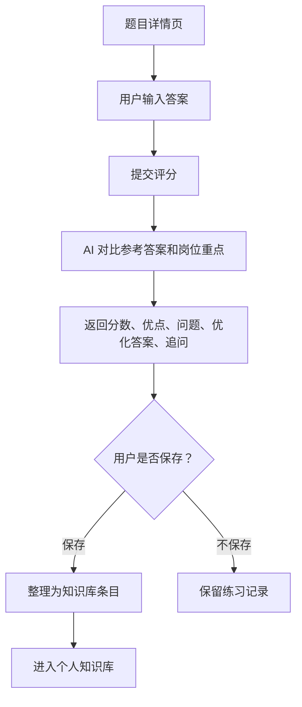
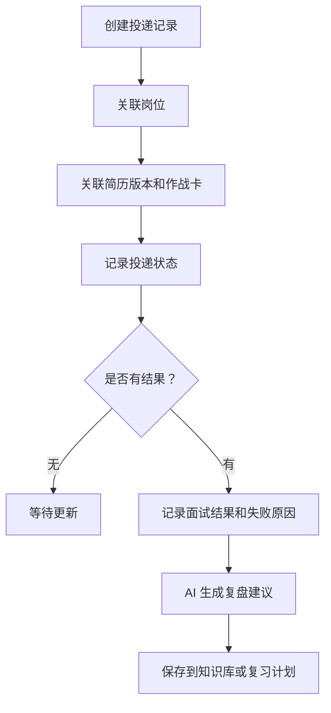

# JobPilot AI 用户流程设计

更新时间：2026-06-24

## 1. 主流程



## 2. 首次使用流程

目标：让新用户尽快从空状态进入第一张岗位作战卡。



关键设计点：

- Dashboard 空状态只保留一个主行动：开始准备一个岗位。
- 简历录入支持文件上传和文本粘贴，文件解析失败时直接进入文本编辑模式。
- 生成作战卡前明确展示输入来源：简历版本和岗位 JD。

## 3. 简历录入流程



关键状态：

- 解析中
- 解析失败
- 内容为空
- 版本保存成功
- 默认简历已变更

## 4. 岗位作战卡生成流程



页面必须展示：

- 匹配分
- 核心要求
- 技能或能力拆解
- 已有优势
- 明显短板
- 简历优化建议
- 面试重点
- 三天补强计划
- 七天补强计划
- 投递风险提醒

## 5. 题目生成流程



题目清单应标注来源：

- 公共题库
- AI 补充
- 候选题

## 6. 练习评分流程



关键设计点：

- 用户答案编辑区和 AI 反馈区左右或上下并列。
- AI 优化答案必须可复制、可编辑、可保存。
- 掌握状态需要就近操作：未练习、需复习、已掌握、高频重点。

## 7. 投递复盘流程



投递状态建议：

```text
准备中
已投递
笔试中
面试中
已通过
已拒绝
已放弃
```

