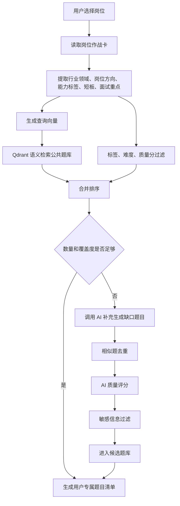

# JobPilot AI 长期项目方案与项目规范

更新时间：2026-06-24

## 1. 项目定位

JobPilot AI 的长期定位是一个面向各行各业求职者的 AI 求职备战系统。

第一阶段 MVP 先聚焦计算机领域求职者，优先覆盖 Java 后端、前端开发、AI 应用开发、测试开发、运维开发、数据开发等方向。后续再扩展到产品、运营、市场、销售、设计、金融、教育、医药、制造等更多行业和岗位。

它不是单纯的 AI 简历优化工具，而是围绕一个目标岗位，把简历、岗位 JD、岗位作战卡、公共题库、AI 补题、练习评分、个人知识库和投递复盘串成一个完整闭环。

一句话卖点：

> 普通 AI 求职助手帮你生成内容，JobPilot AI 帮你围绕一个岗位打一场有准备的仗。

核心流程：

```text
简历解析
-> JD 分析
-> 岗位作战卡
-> 公共题库检索
-> AI 补充生成题目
-> 用户练习
-> AI 评分追问
-> 个人知识库沉淀
-> 投递复盘
```

## 2. 目标用户

长期目标用户：

- 各行业应届毕业生
- 转行求职者
- 初中级职场人
- 希望针对具体岗位系统备战的求职者
- 需要沉淀个人面试知识库和投递复盘的求职者

第一阶段 MVP 优先服务：

- 应届毕业生
- 转行或初级开发者
- 准备校招、实习、社招初级岗位的用户
- 以 Java 后端、前端开发、AI 应用开发、测试开发、运维开发、数据开发为主要方向的求职者

用户核心痛点：

- 不知道自己的简历和岗位 JD 到底匹不匹配
- 不知道面试重点应该围绕哪些岗位能力、专业知识和项目经历准备
- 盲目刷题，题目和目标岗位关联不强
- AI 每次生成的内容随机，无法沉淀成稳定资产
- 练习答案后缺少评分、追问和优化
- 投递失败后没有形成复盘和下一步行动计划

## 3. 产品原则

### 3.1 完整闭环优先

第一版优先完成从简历到投递复盘的主流程。每个模块可以先做基础版本，但主链路必须跑通。

第一版主链路：

```text
注册登录
-> 录入简历
-> 录入岗位 JD
-> 生成岗位作战卡
-> 检索公共题库
-> AI 补题进入候选题库
-> 用户练习
-> AI 评分和追问
-> 加入个人知识库
-> 记录投递结果
```

### 3.2 公共题库和个人知识库必须分开

公共题库用于沉淀高质量通用题目，强调复用、质量分、标签和检索。

个人知识库用于沉淀用户自己的答案、项目话术、错题总结、技术笔记和面试复盘。

两者不能混在一张表里，也不能混成同一种业务概念。

### 3.3 AI 生成内容不能直接污染公共资产

AI 生成的新题必须先进入候选题库，经过相似题去重、AI 质量评分、敏感信息过滤和审核后，才可以进入公共题库。

第一版可以实现：

- 自动相似题去重
- 自动质量评分
- 自动敏感词过滤
- 管理端或数据库手动通过

后续再补完整审核后台。

### 3.4 题库优先，AI 补充

系统生成专属面试题时，必须优先从公共题库检索。

只有当题库召回数量不足、质量不足或缺少关键能力点时，才调用 AI 补充生成。第一版的关键能力点主要表现为计算机技术点。

目标：

- 降低大模型调用成本
- 提升题目质量稳定性
- 让公共题库越用越强
- 减少随机低质题目

### 3.5 Docker Compose 从开发阶段开始使用

开发阶段至少用 Docker Compose 管理：

- MySQL
- Redis
- Qdrant

生产阶段再将 backend、frontend、mysql、redis、qdrant 全部纳入 Docker Compose。

### 3.6 长期多行业扩展，当前计算机领域打穿

产品长期不能写死为“程序员刷题系统”，而应抽象为“岗位备战系统”。

第一阶段可以使用计算机领域作为样板场景，把简历解析、JD 分析、岗位作战卡、题库检索、AI 补题、练习评分、知识库和投递复盘完整跑通。

系统设计时必须保留行业扩展能力：

- 用 `job_direction` 表示岗位方向，而不是只表示技术方向
- 用标签体系表达岗位能力、专业知识、工具技能和经历要求
- 公共题库按行业、岗位方向、能力标签和题型组织
- Prompt 输入中保留行业领域、岗位类型、求职阶段
- 前端筛选项避免只写死计算机技术栈
- 数据表字段优先使用通用命名，例如 `tags`、`question_type`、`category`

后续扩展行业时，优先新增行业题库、行业 Prompt 模板和岗位方向配置，而不是重做主流程。

## 4. MVP 范围

第一版 MVP 聚焦计算机领域，把一个行业样板完整做深做透。长期产品方向仍然是多行业求职备战系统。

### 4.1 第一版必须实现

- 用户注册登录
- JWT 鉴权
- PDF / DOCX / 文本简历录入
- 文本型 PDF 和 DOCX 简历解析
- 简历保存多个版本
- 岗位 JD 管理
- AI 生成岗位作战卡
- Redis 缓存相同作战卡分析结果
- 公共题库检索
- 题库不足时 AI 补充生成题目
- AI 生成题进入候选题库
- 用户练习题目
- AI 对答案评分、优化、追问
- 用户把优质答案加入个人知识库
- Docker Compose 一键启动基础依赖
- Docker Compose 一键部署完整服务

### 4.2 第一版暂不实现

- OCR
- 扫描版 PDF 识别
- 图片简历识别
- 老式 `.doc` 解析
- 自动爬招聘网站
- 自动投递
- 支付
- 微信登录
- 浏览器插件
- 语音面试
- 复杂 Agent 编排
- 多租户后台

## 5. 长期路线图

### 阶段 1：基础骨架

目标：系统能跑起来，前后端和基础依赖联通。

核心任务：

- 初始化 Spring Boot 3 后端项目
- 初始化 React + Vite 前端项目
- 使用 Docker Compose 启动 MySQL、Redis、Qdrant
- 完成用户注册、登录、JWT 鉴权
- 完成前端基础布局、路由和登录态管理
- 建立统一响应结构、异常处理和基础日志

交付物：

- `backend` 可本地启动
- `frontend` 可本地启动
- `docker-compose.dev.yml`
- 用户可注册、登录、获取当前用户信息

验收标准：

- 用户登录后可以访问 Dashboard
- 未登录访问业务接口返回 401
- MySQL、Redis、Qdrant 可通过服务名访问

### 阶段 2：基础业务数据

目标：系统能保存真实简历和岗位数据。

核心任务：

- PDF 简历上传和解析
- DOCX 简历上传和解析
- 文本简历录入
- 简历 CRUD
- 默认简历设置
- 岗位 JD CRUD
- 岗位状态管理
- 前后端联调简历和岗位页面

交付物：

- 简历管理页
- 岗位管理页
- 简历解析服务
- 文件上传配置

验收标准：

- 用户可以上传文本型 PDF 并看到解析文本
- 用户可以上传 DOCX 并看到解析文本
- 用户可以手动编辑简历内容
- 用户可以创建岗位并粘贴 JD

### 阶段 3：岗位作战卡

目标：形成产品核心亮点。

核心任务：

- 接入大模型 API
- 设计岗位作战卡 Prompt
- 规范 JSON 输出格式
- 生成并保存岗位作战卡
- 使用 Redis 缓存相同简历、JD 和 Prompt 版本的分析结果
- 作战卡页面展示
- 作战卡结构化字段入库

交付物：

- `battle_card` 表
- AI 作战卡服务
- 作战卡详情页
- Redis 缓存 key 设计

验收标准：

- 相同简历和 JD 第二次生成优先命中缓存
- 作战卡能展示匹配分、核心要求、技能拆解、优势、短板、建议、计划和风险。第一版的技能拆解主要体现为计算机技术栈
- AI 返回 JSON 解析失败时有明确错误和重试机制

### 阶段 4：题库系统

目标：实现差异化的“题库优先 + AI 补题”能力。

核心任务：

- 初始化公共题库
- 建立题目标签体系
- 题目向量化
- 使用 Qdrant 做语义检索
- 从作战卡提取能力标签、短板和面试重点。第一版能力标签以技术标签为主
- 召回高质量公共题库题目
- 判断题目数量和覆盖度是否足够
- 不足时调用 AI 补题
- AI 新题进入候选题库
- 候选题相似题去重、质量评分、敏感信息过滤

交付物：

- `question_bank` 表
- `candidate_question` 表
- Qdrant collection
- 题目生成服务
- 题目列表页和详情页

验收标准：

- 系统生成题目前先检索公共题库
- 公共题库不足时才调用 AI
- AI 新题不直接进入公共题库
- 用户可获得一组与岗位作战卡相关的专属题目

### 阶段 5：练习与个人知识库

目标：形成学习闭环和个人资产沉淀。

核心任务：

- 用户答题
- AI 评分
- AI 优化回答
- AI 生成面试官追问
- 掌握状态管理
- 一键加入个人知识库
- 知识库分类、标签和搜索
- 关联题目、岗位和作战卡

交付物：

- `user_question` 表
- `question_practice` 表
- `personal_knowledge_item` 表
- 练习详情页
- 个人知识库页

验收标准：

- 用户提交答案后可以看到分数、反馈、优化答案和追问
- 用户可以把优质答案保存到个人知识库
- 个人知识库可按分类、标签、关键词筛选

### 阶段 6：投递复盘与完整部署

目标：让项目可演示、可部署、可持续使用。

核心任务：

- 投递记录管理
- 关联岗位、简历版本和作战卡
- 记录投递状态、面试结果和失败原因
- AI 生成复盘建议
- 后端 Dockerfile
- 前端 Dockerfile + Nginx
- 完整 `docker-compose.yml`
- `.env.example`
- README
- 演示数据和演示视频脚本

交付物：

- `application_record` 表
- 投递记录页
- 完整部署配置
- 项目 README

验收标准：

- 一条岗位从录入到复盘可以完整走完
- 新机器可以通过 `.env` 和 Docker Compose 启动服务
- README 能指导本地开发和生产部署

### 阶段 7：质量增强

目标：从可用走向稳定。

核心任务：

- AI 调用日志和成本统计
- Prompt 版本管理
- 题目质量回流
- 题库使用次数统计
- Dashboard 统计缓存
- 接口限流
- 全局审计日志
- 基础测试覆盖

验收标准：

- 能看到 AI 调用次数、模型、token、成本
- 能区分不同 Prompt 版本产出的内容
- 高频使用和高质量题目能沉淀为公共题库资产

### 阶段 8：多行业扩展

目标：在计算机领域闭环验证后，把系统扩展为跨行业岗位备战平台。

核心任务：

- 建立行业配置体系
- 建立不同岗位方向的题库分类
- 支持行业级 Prompt 模板
- 支持不同岗位的能力标签体系
- 支持非技术岗位的案例题、业务题、情景题、行为题
- 扩展 Dashboard 的行业化统计维度
- 建立公共题库的行业审核规则

优先扩展方向：

- 产品经理
- 运营
- 市场
- 销售
- 设计
- 金融
- 教育
- 医药
- 制造

其他可选方向：

- 管理端题库审核
- 题目质量人工标注
- 面试计划日历
- 模拟面试
- 语音面试
- 招聘网站 JD 导入
- 浏览器插件
- 多模型供应商切换
- 个人学习路径推荐
- 组织版或班级版

验收标准：

- 新增行业不需要修改主业务流程
- 新增行业主要通过岗位方向、标签、题库和 Prompt 模板配置完成
- 非计算机岗位也可以生成作战卡、召回题目、补充题目、练习评分和沉淀知识库

## 6. 总体架构

### 6.1 服务组成

```text
frontend
  React + Vite + Ant Design

backend
  Java 17 + Spring Boot 3 + MyBatis-Plus

mysql
  用户、简历、岗位、作战卡、题库、练习、知识库、投递记录

redis
  AI 结果缓存、限流、Dashboard 缓存、JWT 黑名单

qdrant
  公共题库语义检索、相似题去重

ai provider
  大模型 API、Embedding API
```

### 6.2 推荐项目结构

```text
jobpilot-ai
├─ backend
│  ├─ Dockerfile
│  ├─ pom.xml
│  └─ src
│     ├─ main
│     │  ├─ java
│     │  │  └─ com/jobpilot
│     │  │     ├─ JobPilotApplication.java
│     │  │     ├─ common
│     │  │     ├─ config
│     │  │     ├─ security
│     │  │     ├─ module
│     │  │     │  ├─ auth
│     │  │     │  ├─ user
│     │  │     │  ├─ resume
│     │  │     │  ├─ job
│     │  │     │  ├─ battlecard
│     │  │     │  ├─ question
│     │  │     │  ├─ practice
│     │  │     │  ├─ knowledge
│     │  │     │  ├─ application
│     │  │     │  └─ ai
│     │  │     └─ infrastructure
│     │  └─ resources
│     │     ├─ application.yml
│     │     ├─ mapper
│     │     └─ db
│     └─ test
├─ frontend
│  ├─ Dockerfile
│  ├─ nginx.conf
│  ├─ package.json
│  ├─ index.html
│  └─ src
│     ├─ api
│     ├─ app
│     ├─ components
│     ├─ layouts
│     ├─ pages
│     ├─ routes
│     ├─ stores
│     ├─ types
│     └─ utils
├─ docs
├─ deploy
├─ docker-compose.yml
├─ docker-compose.dev.yml
├─ .env.example
└─ README.md
```

## 7. 后端规范

### 7.1 技术栈

- Java 17
- Spring Boot 3
- Spring Security
- MyBatis-Plus
- MySQL 8
- Redis
- JWT
- Maven
- Apache Tika / PDFBox + Apache POI
- Qdrant
- 大模型 API
- Embedding API

### 7.2 分层约定

每个业务模块建议采用：

```text
controller
service
service/impl
mapper
entity
dto
vo
convert
```

职责：

- `controller`：处理 HTTP 入参、登录用户、响应包装
- `service`：承载业务流程和事务边界
- `mapper`：数据库访问
- `entity`：数据库表映射
- `dto`：请求入参
- `vo`：响应出参
- `convert`：DTO、Entity、VO 转换

### 7.3 统一响应结构

建议响应格式：

```json
{
  "code": 0,
  "message": "ok",
  "data": {}
}
```

错误响应：

```json
{
  "code": 40001,
  "message": "未登录或登录已过期",
  "data": null
}
```

### 7.4 错误码建议

```text
0       成功
40000   请求参数错误
40001   未登录或登录过期
40003   无权限
40004   资源不存在
40900   资源冲突
42900   请求过于频繁
50000   系统异常
50010   AI 服务调用失败
50011   AI 返回格式错误
50020   文件解析失败
```

### 7.5 安全规范

- 密码必须使用 BCrypt 或同等级算法加密
- JWT 只保存必要信息，例如 `userId`、`username`、`tokenId`
- 退出登录时将 `tokenId` 加入 Redis 黑名单
- AI 生成、评分、补题接口必须做用户级限流
- 用户只能访问自己的简历、岗位、作战卡、练习和知识库
- 公共题库可以所有登录用户读取，但写入必须受控
- 文件上传必须限制类型和大小

### 7.6 AI 调用规范

所有 AI 调用必须经过统一 AI 服务，不允许业务模块直接散落调用大模型接口。

统一 AI 服务负责：

- Prompt 拼装
- Prompt 版本号
- 请求 hash
- Redis 缓存
- JSON 解析
- 重试策略
- token 和成本记录
- 调用日志落库

推荐接口：

```java
BattleCardResult generateBattleCard(BattleCardPromptInput input);
QuestionGenerateResult generateQuestions(QuestionGenerateInput input);
AnswerEvaluationResult evaluateAnswer(AnswerEvaluationInput input);
KnowledgeFormatResult formatKnowledgeItem(KnowledgeFormatInput input);
```

### 7.7 Prompt 版本规范

每个 Prompt 场景必须有版本号。

示例：

```text
battle-card:v1
question-generate:v1
answer-evaluate:v1
knowledge-format:v1
```

当 Prompt 结构变化、输出 JSON 字段变化或评分标准变化时，必须升级版本号。

### 7.8 Redis Key 规范

```text
ai:battle-card:{requestHash}
ai:question-generate:{battleCardId}:{promptVersion}
ai:evaluate-answer:{requestHash}
rate-limit:user:{userId}:ai-generate
rate-limit:user:{userId}:ai-evaluate
dashboard:user:{userId}
jwt:blacklist:{tokenId}
```

缓存建议：

- 作战卡缓存：7 天
- 题目生成缓存：3 天
- 答案评分缓存：1 天
- Dashboard 缓存：5 分钟
- JWT 黑名单：与 token 剩余有效期一致

## 8. 前端规范

### 8.1 技术栈

- React
- Vite
- React Router
- Axios
- Ant Design

### 8.2 路由

```text
/login
/register
/dashboard
/resumes
/jobs
/jobs/:id
/battle-cards/:id
/questions
/questions/:id
/knowledge
/applications
/settings
```

### 8.3 页面职责

Dashboard：

- 简历数量
- 岗位数量
- 已生成作战卡数量
- 题库题目数量
- 本周待复习题目
- 投递状态统计

简历页：

- 上传 PDF
- 上传 DOCX
- 粘贴文本
- 查看解析结果
- 编辑简历内容
- 设置默认简历

岗位页：

- 录入岗位信息
- 粘贴 JD
- 查看岗位列表
- 进入岗位详情
- 生成岗位作战卡

作战卡页：

- 展示匹配分
- 展示核心要求
- 展示用户优势
- 展示明显短板
- 展示简历优化建议
- 展示面试重点
- 展示三天补强计划
- 展示七天补强计划
- 提供生成题目按钮

题库页：

- 标签筛选，第一版以技术标签为主
- 题目类型筛选
- 难度筛选
- 掌握状态筛选
- 关联岗位筛选

题目练习页：

- 题目内容
- 参考答案
- 用户回答输入框
- AI 评分
- AI 优化回答
- AI 追问
- 加入个人知识库按钮

个人知识库页：

- 分类
- 标签
- 搜索
- 查看详情
- 编辑条目
- 掌握程度标记

### 8.4 前端 API 规范

- 所有请求封装在 `src/api`
- Axios 拦截器统一附加 JWT
- 401 统一跳转登录页
- 业务错误统一 message 提示
- 文件上传使用独立 API 方法

示例结构：

```text
src/api/auth.ts
src/api/resume.ts
src/api/job.ts
src/api/battleCard.ts
src/api/question.ts
src/api/knowledge.ts
src/api/application.ts
```

### 8.5 前端状态规范

第一版只保留必要全局状态：

- 当前用户
- token
- 页面级筛选条件

业务数据优先由页面请求接口获取，不提前引入复杂状态管理。

## 9. 数据库规范

### 9.1 命名约定

- 表名使用小写蛇形命名
- 字段名使用小写蛇形命名
- 主键统一为 `id`
- 用户归属字段统一为 `user_id`
- 创建时间统一为 `created_at`
- 更新时间统一为 `updated_at`
- JSON 内容可以先使用 `TEXT`，后续按需升级为 `JSON`
- 涉及岗位和题库的表保留 `industry` 字段，第一版默认使用 `计算机/互联网`

### 9.2 核心表

#### user

```text
id
username
password_hash
email
created_at
updated_at
```

#### resume

```text
id
user_id
title
target_role
content
file_type
file_url
version
is_default
created_at
updated_at
```

#### job_post

```text
id
user_id
company_name
position_name
city
salary_range
industry
job_direction
jd_content
source
status
created_at
updated_at
```

#### battle_card

```text
id
user_id
resume_id
job_post_id
match_score
core_requirements
skill_breakdown
matched_points
weak_points
resume_suggestions
interview_focus
three_day_plan
seven_day_plan
risk_tips
raw_ai_result
created_at
```

#### question_bank

```text
id
title
content
industry
job_direction
question_type
difficulty
tags
reference_answer
quality_score
usage_count
source
created_at
updated_at
```

#### candidate_question

```text
id
title
content
industry
job_direction
question_type
difficulty
tags
reference_answer
quality_score
duplicate_score
status
source
raw_ai_result
created_at
updated_at
```

#### user_question

```text
id
user_id
question_id
job_post_id
battle_card_id
status
created_at
updated_at
```

#### question_practice

```text
id
user_id
question_id
user_answer
ai_score
ai_feedback
ai_optimized_answer
ai_follow_up
created_at
```

#### personal_knowledge_item

```text
id
user_id
title
content
category
tags
source_type
source_id
source_question_id
mastery_level
created_at
updated_at
```

#### application_record

```text
id
user_id
job_post_id
resume_id
battle_card_id
status
apply_date
interview_date
result
failure_reason
note
created_at
updated_at
```

#### ai_call_log

```text
id
user_id
scene
request_hash
prompt_tokens
completion_tokens
model_name
cost
created_at
```

## 10. 后端接口规范

### 10.1 认证接口

```text
POST /api/auth/register
POST /api/auth/login
GET  /api/user/me
POST /api/auth/logout
```

### 10.2 简历接口

```text
POST   /api/resumes/upload
POST   /api/resumes/text
GET    /api/resumes
GET    /api/resumes/{id}
PUT    /api/resumes/{id}
DELETE /api/resumes/{id}
```

### 10.3 岗位接口

```text
POST   /api/jobs
GET    /api/jobs
GET    /api/jobs/{id}
PUT    /api/jobs/{id}
DELETE /api/jobs/{id}
```

### 10.4 岗位作战卡接口

```text
POST /api/battle-cards/generate
GET  /api/battle-cards/{id}
GET  /api/jobs/{jobId}/battle-card
```

### 10.5 题目接口

```text
POST /api/questions/generate-for-job
GET  /api/questions
GET  /api/questions/{id}
PUT  /api/questions/{id}/status
```

### 10.6 练习接口

```text
POST /api/questions/{id}/practice
POST /api/questions/{id}/evaluate
GET  /api/questions/{id}/practices
```

### 10.7 知识库接口

```text
POST   /api/knowledge
GET    /api/knowledge
GET    /api/knowledge/{id}
PUT    /api/knowledge/{id}
DELETE /api/knowledge/{id}
POST   /api/questions/{id}/save-to-knowledge
```

### 10.8 投递记录接口

```text
POST /api/applications
GET  /api/applications
PUT  /api/applications/{id}
```

## 11. AI 场景规范

### 11.1 岗位作战卡

输入：

- 用户简历
- 岗位 JD
- 行业领域
- 岗位方向
- 求职阶段
- Prompt 版本号

第一版可先固定为：

- 行业领域：计算机 / 互联网
- 求职阶段：应届生 / 初级开发者

输出 JSON：

```json
{
  "matchScore": 78,
  "coreRequirements": [],
  "skillBreakdown": [],
  "matchedPoints": [],
  "weakPoints": [],
  "resumeSuggestions": [],
  "interviewFocus": [],
  "threeDayPlan": [],
  "sevenDayPlan": [],
  "riskTips": []
}
```

### 11.2 专属题目生成

输入：

- 岗位作战卡
- 已有题库召回结果
- 仍缺少的能力点，第一版主要是技术点
- 岗位方向
- 用户项目或经历背景摘要

输出 JSON：

```json
{
  "questions": [
    {
      "type": "Redis专项题",
      "difficulty": "中等",
      "title": "如何解决缓存击穿问题？",
      "content": "结合你的项目说明 Redis 缓存击穿如何产生，以及如何解决。",
      "referenceAnswer": "...",
      "tags": ["Redis", "缓存击穿", "项目追问"]
    }
  ]
}
```

### 11.3 答案评分

输入：

- 题目
- 参考答案
- 用户答案
- 岗位方向
- 作战卡面试重点

输出：

- 评分
- 回答优点
- 回答问题
- 优化后的回答
- 面试官可能追问

### 11.4 知识条目整理

输入：

- 题目
- 用户答案
- AI 优化答案
- 追问

输出：

- 标题
- 分类
- 标签
- 核心知识点
- 面试回答版本
- 注意事项

## 12. 题库检索与 AI 补题流程



排序建议：

```text
final_score =
  semantic_score * 0.45
  + tag_match_score * 0.25
  + quality_score * 0.20
  + difficulty_fit_score * 0.10
```

## 13. 候选题库规范

候选题状态：

```text
pending      待审核
approved     已通过
rejected     已拒绝
duplicate    相似重复
```

候选题进入公共题库的条件：

- `quality_score >= 75`
- `duplicate_score < 0.85`
- 不包含敏感信息
- 题干清晰
- 参考答案可用
- 标签完整

第一版可以通过 SQL 或简易管理接口手动审核。

## 14. 个人知识库规范

知识库分类建议：

```text
项目话术
技术笔记
错题总结
面试复盘
HR 回答
简历素材
```

掌握程度：

```text
need_review
normal
mastered
important
```

来源类型：

```text
practice
manual
application_review
resume_suggestion
```

知识库条目必须支持：

- 用户隔离
- 标签搜索
- 关键词搜索
- 关联题目
- 关联岗位
- 关联作战卡

## 15. Docker Compose 规范

### 15.1 开发阶段

开发阶段建议：

- 前端本地运行
- 后端本地运行
- MySQL / Redis / Qdrant 通过 Docker Compose 运行

服务：

```text
mysql
redis
qdrant
```

建议文件：

```text
docker-compose.dev.yml
```

### 15.2 生产阶段

生产阶段服务：

```text
mysql
redis
qdrant
backend
frontend
```

建议文件：

```text
docker-compose.yml
```

### 15.3 环境变量

必须提供 `.env.example`，不能提交真实密钥。

示例：

```text
MYSQL_DATABASE=jobpilot
MYSQL_USER=jobpilot
MYSQL_PASSWORD=change_me
MYSQL_ROOT_PASSWORD=change_me

REDIS_PASSWORD=change_me

JWT_SECRET=change_me
JWT_EXPIRE_MINUTES=10080

AI_API_BASE_URL=https://api.example.com
AI_API_KEY=change_me
AI_MODEL=example-chat-model
EMBEDDING_MODEL=example-embedding-model

QDRANT_URL=http://qdrant:6333
```

## 16. 开发协作规范

### 16.1 分支建议

```text
main                 稳定分支
dev                  开发集成分支
feature/auth         功能分支示例
feature/resume
feature/battle-card
feature/question-bank
fix/login-token
```

### 16.2 Commit 规范

```text
feat: add resume upload api
fix: handle ai json parse failure
docs: add project spec
refactor: simplify question ranking service
test: add battle card service tests
chore: update docker compose config
```

### 16.3 代码提交前检查

后端：

```text
mvn test
mvn package
```

前端：

```text
npm run lint
npm run build
```

部署：

```text
docker compose config
docker compose up -d --build
```

## 17. 测试策略

第一版测试优先级：

1. 用户认证和权限隔离
2. 简历解析
3. 作战卡 JSON 解析
4. AI 缓存命中
5. 题库检索和补题流程
6. 答案评分保存
7. 个人知识库保存

建议测试类型：

- Service 单元测试
- Controller 集成测试
- AI 返回 mock 测试
- Qdrant 检索 mock 测试
- 前端关键页面 smoke test

## 18. MVP 验收清单

产品验收：

- 用户可以注册登录
- 用户可以录入至少一份简历
- 用户可以录入至少一个岗位
- 用户可以生成一张岗位作战卡
- 用户可以基于岗位生成一组专属题目
- 系统优先从公共题库召回题目
- 题库不足时 AI 生成补充题目
- AI 生成题先进入候选题库
- 用户可以练习题目并获得 AI 反馈
- 用户可以把优质答案加入个人知识库
- 用户可以记录投递结果

工程验收：

- 后端服务可本地启动
- 前端服务可本地启动
- MySQL / Redis / Qdrant 可通过 Compose 启动
- 完整服务可通过 Compose 启动
- README 覆盖本地开发和部署说明
- `.env.example` 完整
- 不提交真实密钥

## 19. 风险与控制

### 19.1 AI 输出不稳定

控制方式：

- 强制 JSON 输出
- JSON Schema 校验
- 失败重试
- 原始 AI 结果落库
- Prompt 版本管理

### 19.2 Token 成本过高

控制方式：

- 公共题库优先检索
- Redis 缓存作战卡和补题结果
- 用户级限流
- AI 调用日志统计
- 相同请求 hash 去重

### 19.3 题库质量下降

控制方式：

- 候选题机制
- 相似题去重
- 质量评分
- 敏感信息过滤
- 人工审核入口

### 19.4 简历解析失败

控制方式：

- 明确只支持文本型 PDF 和 DOCX
- 提供文本粘贴兜底
- 文件解析失败时保留用户手动编辑入口

### 19.5 项目范围膨胀

控制方式：

- 第一版不做 OCR、自动投递、支付、微信登录、浏览器插件、语音面试和复杂 Agent
- 每个阶段必须有可验收交付物
- 先完整闭环，再细节优化

## 20. 下一步建议

建议按照下面顺序开始落地：

1. 创建正式项目目录结构
2. 初始化 Spring Boot 后端
3. 初始化 React + Vite 前端
4. 编写 `docker-compose.dev.yml` 启动 MySQL、Redis、Qdrant
5. 建立基础数据库表
6. 实现注册登录和 JWT 鉴权
7. 实现简历与岗位 CRUD
8. 接入作战卡 AI 生成

第一周目标建议：

- 完成阶段 1
- 开始阶段 2
- 至少让用户可以注册、登录、录入简历、录入岗位

第二周目标建议：

- 完成简历解析
- 完成岗位作战卡生成
- 完成作战卡页面展示

第三周目标建议：

- 完成公共题库初始化
- 完成 Qdrant 检索
- 完成 AI 补题进入候选题库

第四周目标建议：

- 完成练习评分
- 完成个人知识库
- 完成 Docker Compose 部署和 README
